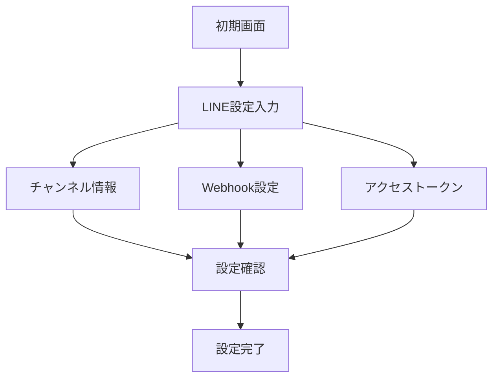

# LINE AIAGENT 実装計画

## 1. コンセプト

### 1.1 基本方針
- 日本語ベースのインターフェース
- LINE操作に特化したUI/UX
- シンプルで直感的な設定フロー
- 自然言語による対話型操作

### 1.2 優先機能
1. LINE設定管理
2. メッセージ管理
3. 画像生成・管理
4. データ集計（シート）

## 2. UIコンポーネント設計

### 2.1 初期設定UI


#### 実装詳細
```typescript
interface LineSetupArtifact {
  channelInfo: {
    id: string;
    secret: string;
    name: string;
  };
  webhook: {
    url: string;
    events: string[];
  };
  accessToken: string;
}
```

### 2.2 LINE操作アーティファクト
1. **チャンネル管理**
   ```typescript
   interface ChannelManagementUI {
     sections: {
       basicInfo: ChannelInfoSection;
       webhookSettings: WebhookSection;
       accessTokens: TokenSection;
     };
     actions: {
       update: () => void;
       test: () => void;
       reset: () => void;
     };
   }
   ```

2. **リッチメニュー設計**
   ```typescript
   interface RichMenuUI {
     canvas: {
       width: number;
       height: number;
       sections: MenuSection[];
     };
     preview: {
       mobile: PreviewComponent;
       desktop: PreviewComponent;
     };
     actions: {
       save: () => void;
       deploy: () => void;
     };
   }
   ```

3. **メッセージテンプレート**
   ```typescript
   interface MessageTemplateUI {
     editor: {
       text: TextEditor;
       flex: FlexMessageEditor;
       quick: QuickReplyEditor;
     };
     preview: MessagePreview;
     library: TemplateLibrary;
   }
   ```

### 2.3 補助アーティファクト
1. **画像管理**
   - アップロード機能
   - DALL-E生成
   - サイズ最適化
   - LINE互換性チェック

2. **データ集計**
   - メッセージ統計
   - ユーザー分析
   - レスポンス効果測定

## 3. 対話システム

### 3.1 基本的な対話フロー
```
ユーザー: LINEの設定をしたい
AIAGENT: はい、LINE設定を開始します。
        まず、以下の情報が必要です：
        1. チャンネルID
        2. チャンネルシークレット
        3. アクセストークン
        
        これらの情報をお持ちですか？

ユーザー: はい、持っています
AIAGENT: では、LINE設定アーティファクトを作成します。
        各項目を入力してください。
        [設定画面を表示]
```

### 3.2 操作サポート例
```
ユーザー: リッチメニューを作りたい
AIAGENT: リッチメニューの作成を開始します。
        以下のオプションから選択してください：
        1. テンプレートから作成
        2. 新規デザイン
        3. 既存メニューの編集
        
        どれにしますか？
```

## 4. 実装優先順位

### Phase 1: 基本設定
1. LINE設定入力UI
   - チャンネル情報フォーム
   - Webhook設定
   - 接続テスト機能

2. 設定保存機能
   - データベース連携
   - 暗号化処理
   - バリデーション

### Phase 2: メッセージ管理
1. テンプレートエディタ
   - テキストメッセージ
   - Flexメッセージ
   - クイックリプライ

2. メッセージ履歴
   - 送信履歴表示
   - 効果測定
   - テンプレート化

### Phase 3: リッチメニュー
1. デザインツール
   - レイアウトエディタ
   - アクション設定
   - プレビュー機能

2. 管理機能
   - 複数メニュー管理
   - A/Bテスト
   - 配信設定

### Phase 4: 拡張機能
1. 画像管理
   - DALL-E連携
   - 最適化処理
   - ライブラリ管理

2. データ分析
   - レポート生成
   - ユーザー分析
   - 改善提案

## 5. 開発ガイドライン

### 5.1 UI原則
- 日本語インターフェース
- シンプルな操作フロー
- 視覚的フィードバック
- エラー防止設計

### 5.2 対話設計
- 明確な日本語での応答
- 段階的なガイダンス
- コンテキスト維持
- エラー時のサポート

### 5.3 データ設計
- 設定情報の暗号化
- セッション管理
- バックアップ対策
- 監査ログ

## 6. 今後の展開

### 6.1 機能拡張案
- 自動応答シナリオ
- カスタムボット作成
- 多チャンネル管理
- 分析レポート自動生成

### 6.2 インテグレーション
- CRMシステム連携
- 分析ツール連携
- カレンダー連携
- タスク管理連携
