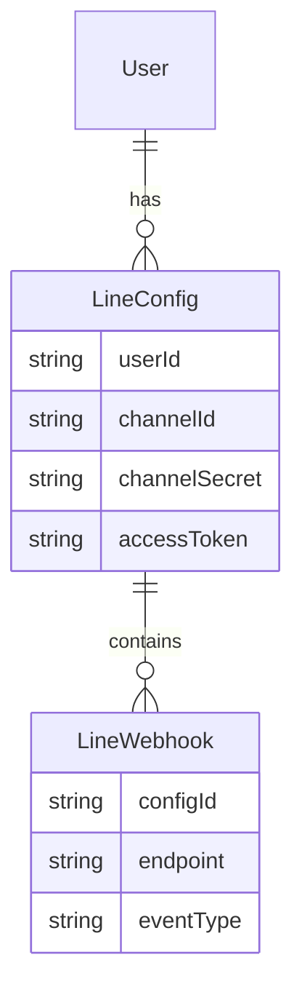

# LINE AIAGENT 実装計画

## 1. アーキテクチャ設計

### 1.1 システム構成
- 既存のChatbotシステム（Next.js + Supabase）
- LINE Messaging API連携
- 自然言語処理エンジン（既存のAIモデル活用）

### 1.2 データモデル拡張

## 2. 段階的実装計画

### Phase 1: 基盤構築
1. LINE設定管理機能
   - チャンネル設定の登録/編集UI
   - Webhookエンドポイントの管理
   - LINE APIクライアントの実装

2. 右カラムUIコンポーネント
   - LINE操作パネルの基本設計
   - 設定画面の実装
   - ステータス表示機能

### Phase 2: 基本機能実装
1. メッセージ管理
   - ステップメール機能
   - テンプレート管理
   - メッセージ履歴表示

2. タグ管理システム
   - タグの作成/編集/削除
   - ユーザーへのタグ付与
   - タグベースのセグメント管理

3. リッチメニュー管理
   - リッチメニューデザイナー
   - メニュー設定のUI
   - A/Bテスト機能

### Phase 3: 自然言語インターフェース
1. コマンド解析システム
   - 自然言語からのLINE API命令への変換
   - コンテキスト管理
   - エラーハンドリング

2. インテリジェントアシスタント
   - 操作提案機能
   - 自動補完
   - 操作履歴の学習

### Phase 4: 高度な機能拡張
1. 分析・レポート機能
   - メッセージ効果測定
   - ユーザー行動分析
   - インサイトレポート

2. 自動化機能
   - シナリオベースの自動応答
   - イベントトリガー設定
   - 条件分岐フロー

## 3. 技術的考慮事項

### 3.1 既存システムとの統合
- 既存のチャットUIをベースに維持
- アーティファクトシステムの活用
- 認証システムの拡張

### 3.2 セキュリティ考慮
- LINE API認証情報の安全な管理
- Webhookエンドポイントの検証
- ユーザーデータの保護

### 3.3 スケーラビリティ
- メッセージキューイングシステム
- キャッシュ戦略
- データベース最適化

## 4. UI/UX設計方針

### 4.1 チャットインターフェース
- 自然言語コマンドの入力
- コンテキストアウェアな応答
- インラインヘルプ/サジェスト

### 4.2 管理パネル
- 直感的な操作フロー
- リアルタイムプレビュー
- ドラッグ&ドロップインターフェース

## 5. 開発ロードマップ

1. **準備フェーズ** (2-3週間)
   - 要件の詳細化
   - アーキテクチャ設計
   - 開発環境セットアップ

2. **Phase 1** (3-4週間)
   - 基盤構築
   - 基本UI実装
   - LINE API連携

3. **Phase 2** (4-5週間)
   - メッセージ管理
   - タグシステム
   - リッチメニュー

4. **Phase 3** (5-6週間)
   - 自然言語処理
   - インテリジェント機能
   - テスト/最適化

5. **Phase 4** (4-5週間)
   - 分析機能
   - 自動化システム
   - 総合テスト

## 6. 次のステップ

### Phase 1の開始準備
1. LINE Messaging APIの設定
   - チャンネルの作成/設定
   - Webhookエンドポイントの準備
   - アクセストークンの取得

2. データベーススキーマの拡張
   - LineConfig テーブルの作成
   - LineWebhook テーブルの作成
   - 既存のUserテーブルとの関連付け

3. 基本UIコンポーネントの設計
   - 右カラムのLINE設定パネル
   - チャンネル設定フォーム
   - ステータス表示領域

### 技術スタック
- フロントエンド: Next.js, React
- バックエンド: Next.js API Routes
- データベース: Supabase (PostgreSQL)
- LINE連携: LINE Messaging API
- UI/UXフレームワーク: 既存のコンポーネントライブラリ
