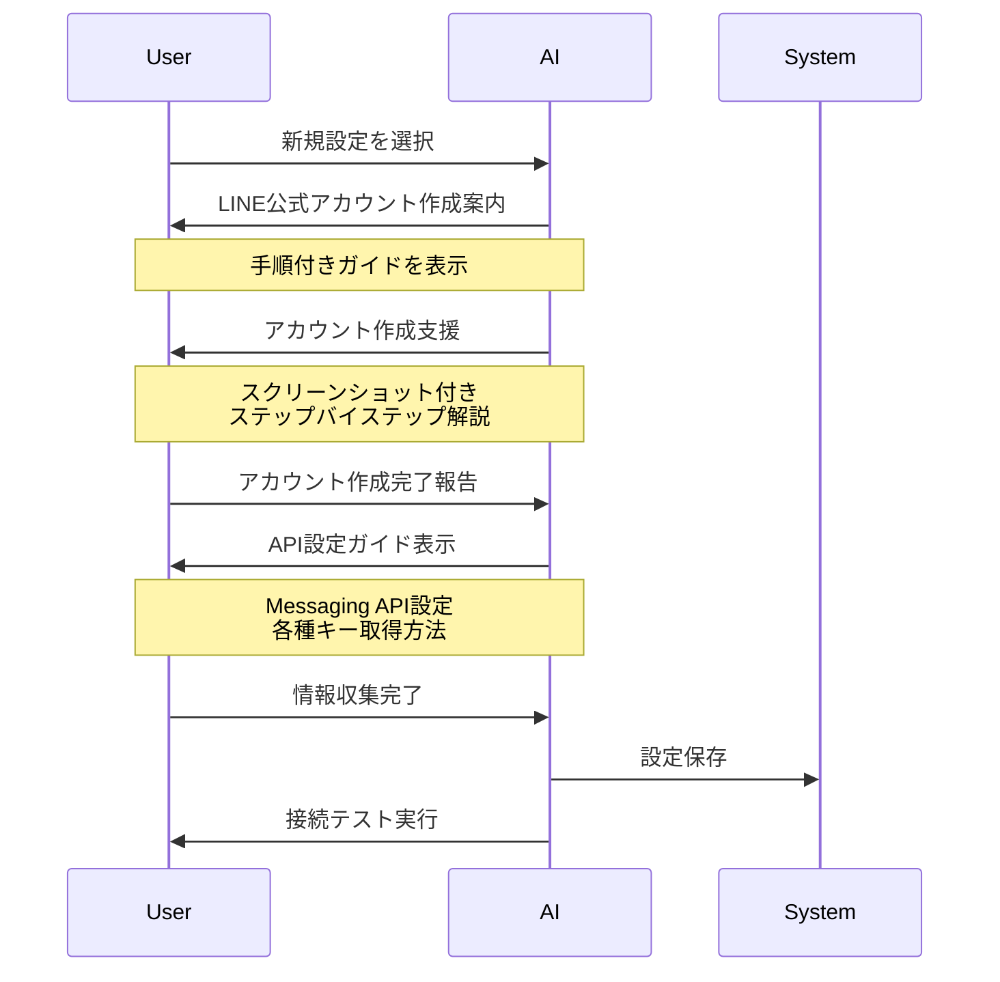
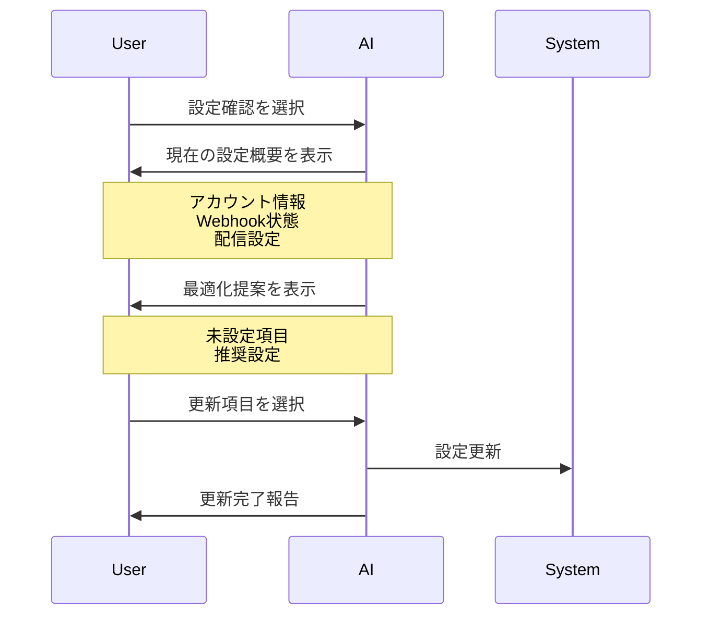
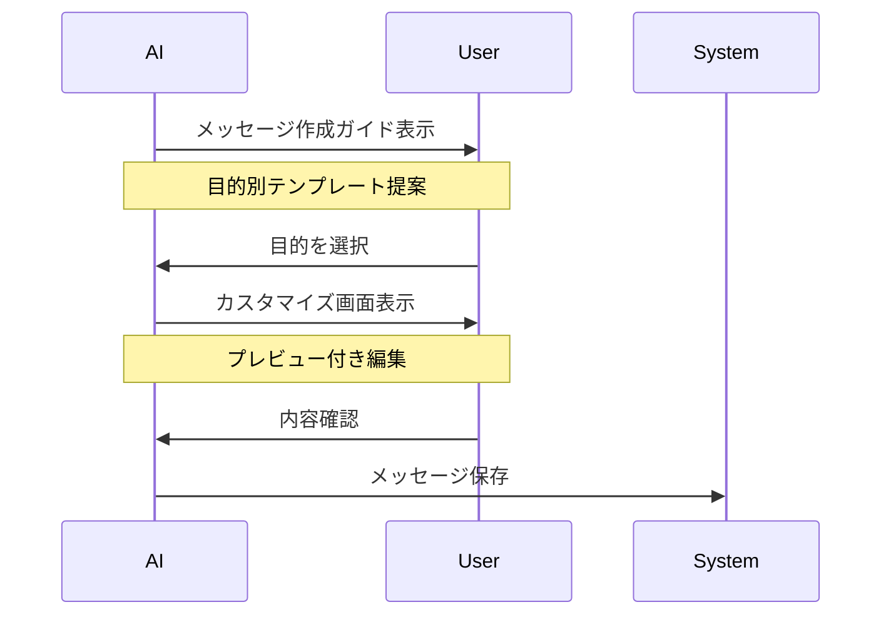
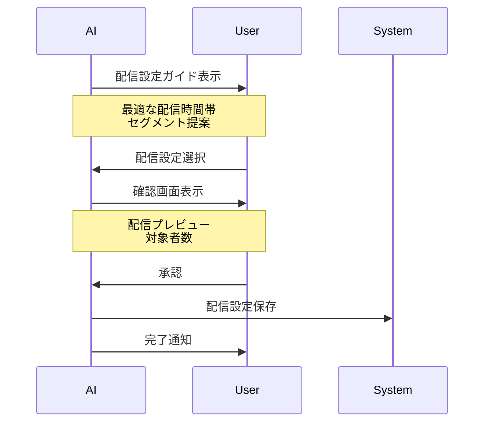
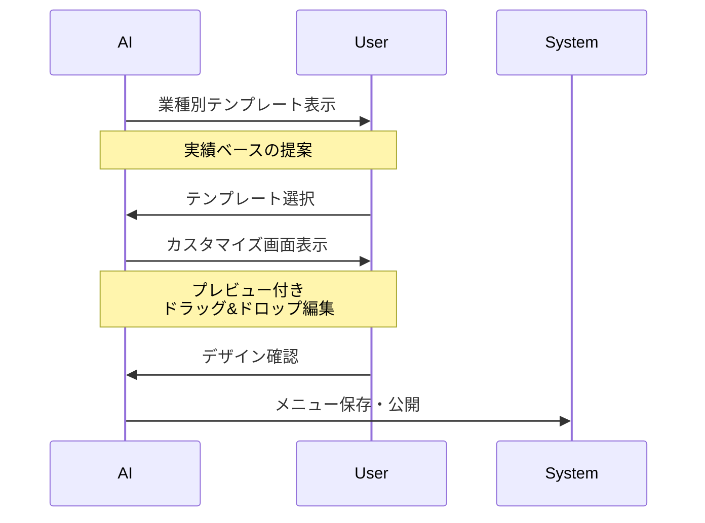
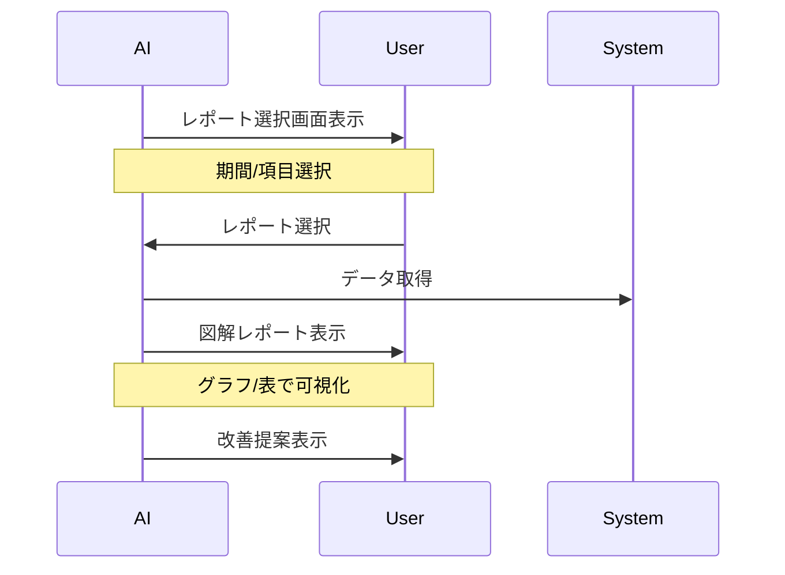
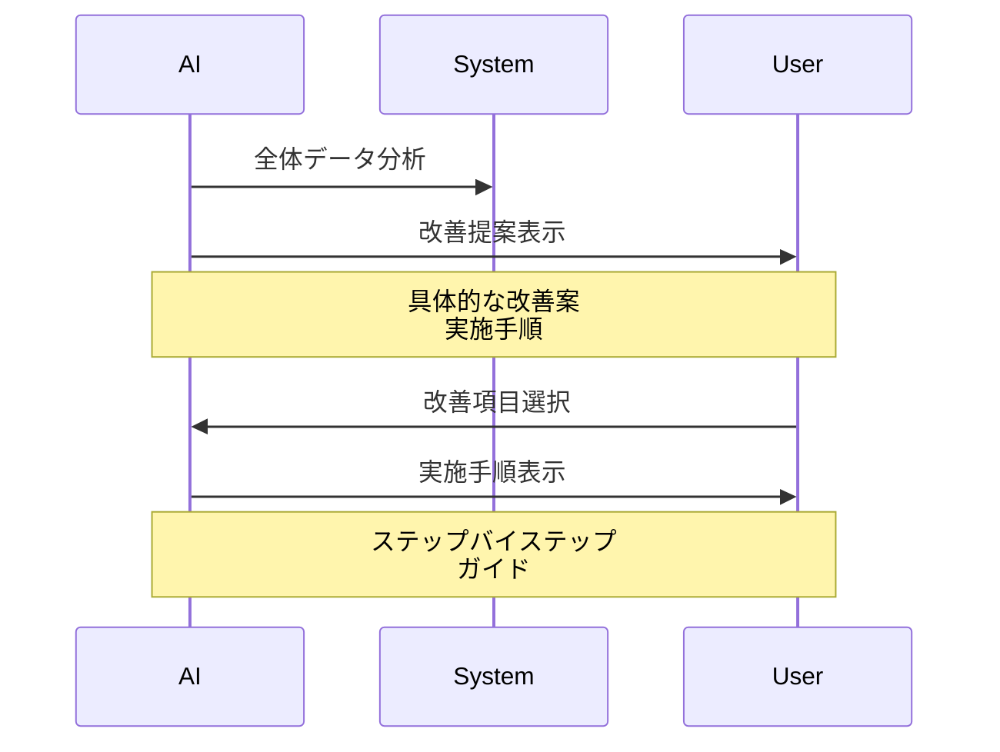

# LINE AIAGENTの自然言語ワークフロー

## 0. AIAGENTの自己認識と役割

### 0.1 基本的な自己認識
```
私はLINE AIAGENTです。LINEビジネスアカウントの設定から運用まで、全面的にサポートいたします。
専門知識がなくても、チャットや選択肢をクリックするだけで、LINEの活用を実現できるようお手伝いします。
```

### 0.2 初期自動返信メッセージ
```
はじめまして！LINE AIAGENTです。
LINEビジネスアカウントの設定からメッセージ配信、分析まで、全てサポートいたします。

まずは以下のいずれかをお選びください：

1. 【新規設定】LINEビジネスアカウントを始める
2. 【設定確認】現在の設定を確認する
3. 【機能紹介】できることを知りたい

[選択ボタンを表示]
```

## 1. LINE設定ワークフロー

### 1.1 新規アカウント設定ガイド


#### 対話例
```
AI: LINEビジネスアカウントの設定を始めましょう。
まず、LINE公式アカウントを作成する必要があります。

【ステップ1: LINE公式アカウント作成】
1. 以下のURLにアクセスしてください：
   [LINE公式アカウントマネージャー]
2. 「アカウントを作成」をクリック
3. ビジネス情報を入力

準備ができましたら、「完了」を選択してください。
[次へ進むボタンを表示]

User: 完了しました
AI: お疲れ様です！次はMessaging APIの設定です。

【ステップ2: Messaging API設定】
1. 左メニューから「プロバイダー」を選択
2. 「チャネル設定」をクリック
3. 以下の情報をコピーしてください：
   - チャネルID
   - チャネルシークレット
   - アクセストークン

各項目が見つかりましたら、下のフォームに入力をお願いします。
[情報入力フォームを表示]

User: （情報入力完了）
AI: 素晴らしいです！設定を保存し、接続テストを実行します。
テスト完了後、実際にメッセージを送ってみましょう。
```

### 1.2 設定確認・更新


#### 対話例
```
AI: 現在の設定状況をご確認いただけます：

【基本設定】
✅ チャネル連携
✅ Webhookエンドポイント
❌ 応答メッセージ
❌ リッチメニュー

以下の設定がおすすめです：
1. 応答メッセージの設定
2. リッチメニューの作成
3. クイックリプライの追加

設定を進めたい項目を選択してください。
[設定項目の選択ボタンを表示]
```

## 2. メッセージ管理ワークフロー

### 2.1 かんたんメッセージ作成


#### 対話例
```
AI: メッセージを作成しましょう。
どのような目的でメッセージを送りたいですか？

【おすすめテンプレート】
1. 🎉 お店の新商品告知
2. 📅 イベント告知
3. 🎁 クーポン配信
4. 📢 一般的なお知らせ
5. 🌟 カスタムメッセージ作成

目的を選択してください。
[目的選択ボタンを表示]

User: お店の新商品告知
AI: 新商品告知用のテンプレートをご用意しました！

【基本フォーマット】
━━━━━━━━━━
✨新商品のご案内✨
━━━━━━━━━━
[商品名]が新登場！

🔸商品特徴
・
・
・

🔸価格
￥○○○○

🔸発売日
○月○日〜

ご来店お待ちしております🎵

各項目を編集してください：
[編集フォームを表示]
```

### 2.2 スマート配信設定


#### 対話例
```
AI: メッセージの配信設定を行います。
過去のデータから、最適な配信設定をご提案します：

【おすすめ配信設定】
⏰ 配信時間：平日18-20時
👥 対象：過去1ヶ月以内の来店ユーザー
📊 予想開封率：45%以上

以下の選択肢からお選びください：
1. おすすめ設定で配信
2. カスタム設定で配信
3. 即時配信

[配信設定選択ボタンを表示]
```

## 3. かんたんリッチメニュー作成

### 3.1 テンプレート活用


#### 対話例
```
AI: お客様の業種に合わせたリッチメニューを作成しましょう。
以下のテンプレートをご用意しています：

【業種別テンプレート】
1. 🏪 小売店向け
   - 商品カタログ
   - クーポン
   - 店舗案内

2. 🍽 飲食店向け
   - メニュー
   - 予約
   - クーポン

3. 💅 サービス業向け
   - 予約
   - メニュー
   - お問い合わせ

業種を選択してください：
[業種選択ボタンを表示]

User: 飲食店向け
AI: 飲食店向けテンプレートをご用意しました！

【カスタマイズ可能項目】
1. メニューの画像
2. ボタンの文言
3. リンク先URL

プレビューを見ながら編集できます：
[ドラッグ&ドロップエディタを表示]
```

## 4. かんたん分析・改善

### 4.1 実績レポート


#### 対話例
```
AI: 実績レポートをご用意しました！

【先月の配信実績】
📊 メッセージ配信数: 1,000通
👀 平均開封率: 55%
🎯 平均クリック率: 25%

【改善ポイント】
1. 開封率アップのコツ
   - 件名の工夫
   - 配信時間の最適化

2. クリック率アップのコツ
   - 画像活用
   - 特典付与

改善したい項目を選択してください：
[改善項目選択ボタンを表示]
```

### 4.2 AIによる改善提案


#### 対話例
```
AI: データ分析から、以下の改善提案をご用意しました：

【改善提案】
1. 🎯 メッセージ配信の最適化
   効果: 開封率15%アップ
   - 配信時間の調整
   - セグメント配信の活用

2. 🎨 リッチメニューの改善
   効果: タップ率25%アップ
   - レイアウト最適化
   - 文言改善

3. 🔄 自動応答メッセージの設定
   効果: 応答率30%アップ
   - シナリオ作成
   - クイックリプライ活用

改善を始めたい項目を選択してください：
[改善項目選択ボタンを表示]
```

## 5. 実装優先順位

### Phase 1: 初期設定支援（1-2週間）
- 初期自動返信メッセージ
- LINE設定ガイド
- 接続テスト機能

### Phase 2: かんたん操作機能（2-3週間）
- 目的別テンプレート
- ワンクリック配信
- プレビュー機能

### Phase 3: ビジュアルエディタ（2-3週間）
- ドラッグ&ドロップ
- リアルタイムプレビュー
- 画像最適化

### Phase 4: AI分析・改善（2-3週間）
- 実績可視化
- 改善提案
- A/Bテスト支援

## 6. 技術要件

### 6.1 ユーザー体験
- ステップバイステップガイド
- ビジュアルプレビュー
- エラー防止機能

### 6.2 システム連携
- LINE API最適化
- リアルタイムバリデーション
- 自動バックアップ

### 6.3 AI機能
- 文脈理解
- レコメンデーション
- 自動最適化

## 7. 次のステップ

1. 初期自動返信の実装
2. 設定ガイドの作成
3. テンプレートの準備
4. AIレコメンド機能の実装
