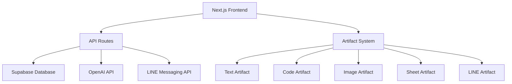

# AI Linechatbotプロジェクト概要

## 1. プロジェクト構成

### 1.1 アーキテクチャ


### 1.2 技術スタック
- **フロントエンド**: Next.js, React, TailwindCSS
- **バックエンド**: Next.js API Routes
- **データベース**: Supabase (PostgreSQL)
- **認証**: NextAuth.js
- **AI**: OpenAI API (GPT-4)
- **外部API**: LINE Messaging API

## 2. アーティファクトシステム

### 2.1 アーティファクトの概念
アーティファクトは、AIとのチャットを通じて生成・管理される特殊なドキュメントです。各アーティファクトは特定の目的に特化した機能を提供し、ユーザーインターフェースとデータ管理を一体化させています。

### 2.2 アーティファクトの種類

#### Text Artifact
- 目的: テキストドキュメントの作成と編集
- 機能: マークダウン形式のテキスト編集
- ユースケース: ドキュメント作成、メモ、記事作成

#### Code Artifact
- 目的: コードの生成と編集
- 機能: シンタックスハイライト、コード補完
- ユースケース: プログラミング、スクリプト作成

#### Image Artifact
- 目的: 画像生成と編集
- 機能: DALL-E統合、画像編集
- ユースケース: 画像生成、デザイン作成

#### Sheet Artifact
- 目的: 表形式データの管理
- 機能: スプレッドシート機能
- ユースケース: データ分析、表の作成

#### LINE Artifact
- 目的: LINE設定の管理
- 機能: 
  - チャンネル設定
  - Webhook管理
  - メッセージテンプレート
- ユースケース: LINEボット設定、自動応答設定

### 2.3 アーティファクトの拡張方法
新しいアーティファクトを追加するには、以下の3つのコンポーネントを実装します：

1. **クライアントコンポーネント** (client.tsx)
```typescript
export interface ArtifactContentProps {
  content: string;
  onSaveContent: (content: string, debounce: boolean) => void;
  isCurrentVersion: boolean;
  // ... その他のProps
}
```

2. **サーバーハンドラー** (server.ts)
```typescript
export interface DocumentHandler<T = ArtifactKind> {
  kind: T;
  onCreateDocument: (args: CreateDocumentCallbackProps) => Promise<void>;
  onUpdateDocument: (args: UpdateDocumentCallbackProps) => Promise<void>;
}
```

3. **型定義の更新** (artifact.tsx)
```typescript
export type ArtifactKind = 'text' | 'code' | 'image' | 'sheet' | 'line';
```

## 3. AIアシスタント機能

### 3.1 モデル設定
```typescript
export const myProvider = customProvider({
  languageModels: {
    'chat-model-small': openai('gpt-4'),
    'chat-model-large': openai('gpt-4'),
    'chat-model-reasoning': openai('gpt-4'),
  },
  imageModels: {
    'small-model': openai.image('dall-e-2'),
    'large-model': openai.image('dall-e-3'),
  },
});
```

### 3.2 応答フロー
1. ユーザー入力を受信
2. 適切なモデルを選択
3. コンテキストを含めてプロンプトを生成
4. AIからの応答を処理
5. 必要に応じてアーティファクトを生成/更新

### 3.3 アーティファクト生成フロー
1. 自然言語による要求を受信
2. 要求の意図を解析
3. 適切なアーティファクトタイプを選択
4. アーティファクトを生成
5. UIで表示・編集可能な状態に

## 4. データベース設計

### 4.1 主要テーブル
- User: ユーザー情報
- Chat: チャット履歴
- Message: メッセージ内容
- Document: アーティファクトデータ
- Vote: メッセージ評価
- Suggestion: 提案内容

### 4.2 Supabase連携
- Transaction Poolerを使用した接続
- マイグレーション管理
- リアルタイムサブスクリプション

## 5. 開発ガイドライン

### 5.1 新機能の追加
1. 要件の明確化
2. アーティファクト設計（必要な場合）
3. データベーススキーマの更新
4. 実装とテスト
5. ドキュメント更新

### 5.2 環境設定
必要な環境変数：
```
OPENAI_API_KEY=
AUTH_SECRET=
NEXTAUTH_URL=
NEXTAUTH_SECRET=
POSTGRES_URL=
```

### 5.3 開発フロー
1. 機能ブランチの作成
2. 実装とテスト
3. コードレビュー
4. マージとデプロイ

## 6. 今後の展開

### 6.1 計画中の機能
- LINE機能の拡張
  - リッチメニュー管理
  - 自動応答シナリオ
  - メッセージ分析
- AIモデルの最適化
- パフォーマンス改善

### 6.2 検討中の統合
- 他のメッセージングプラットフォーム
- 分析ツール
- ワークフロー自動化
